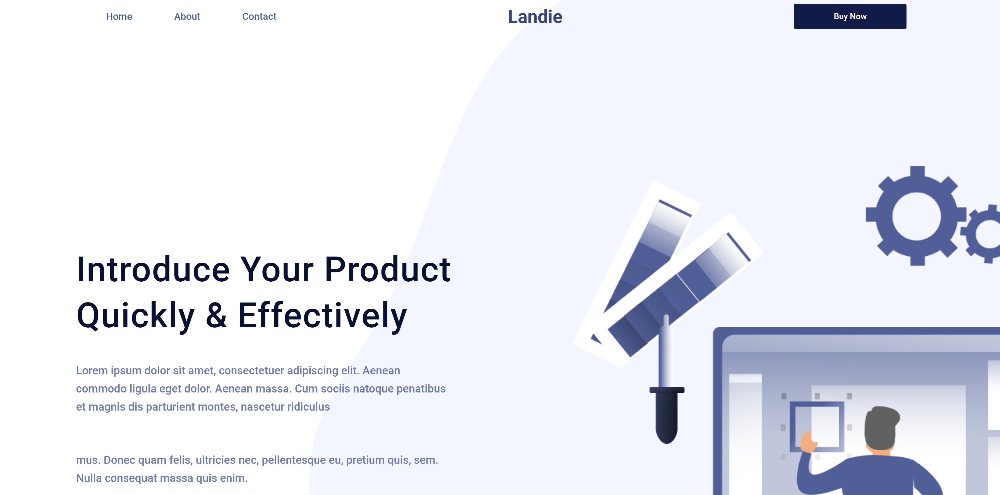
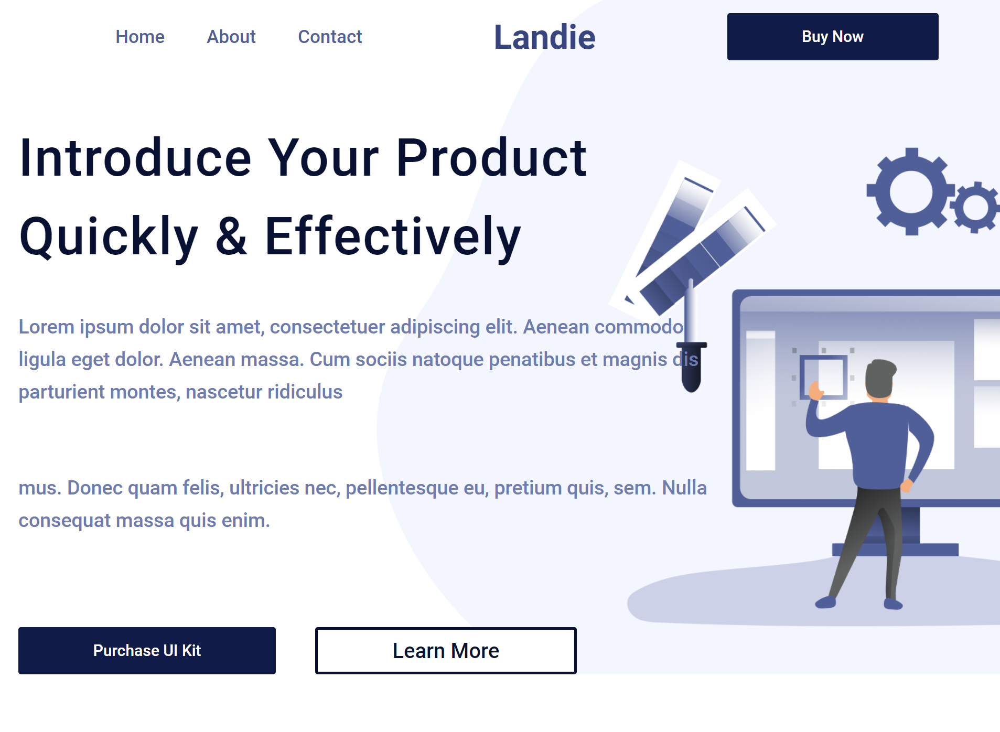
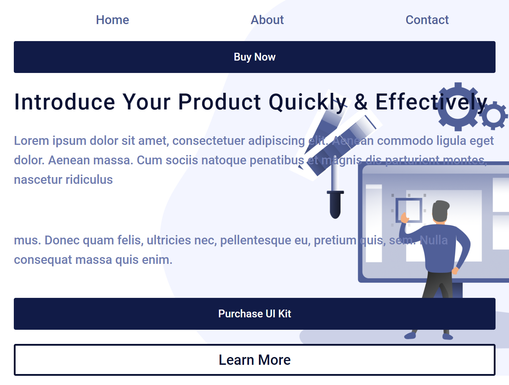
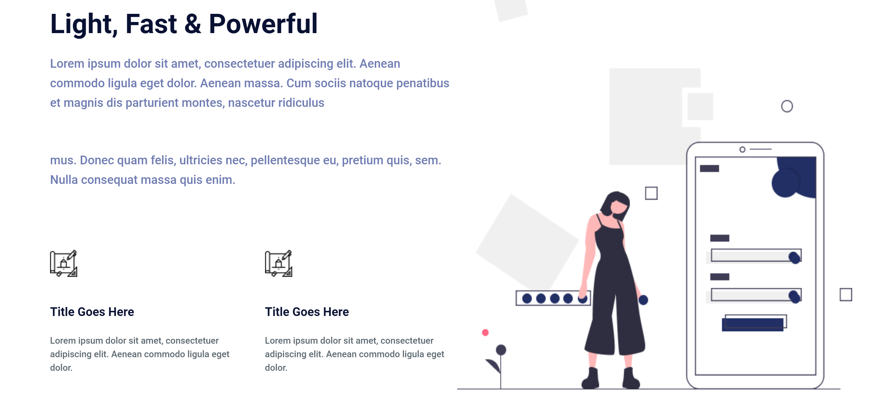
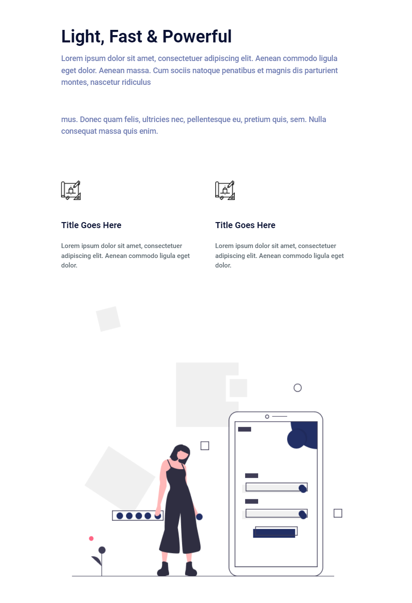
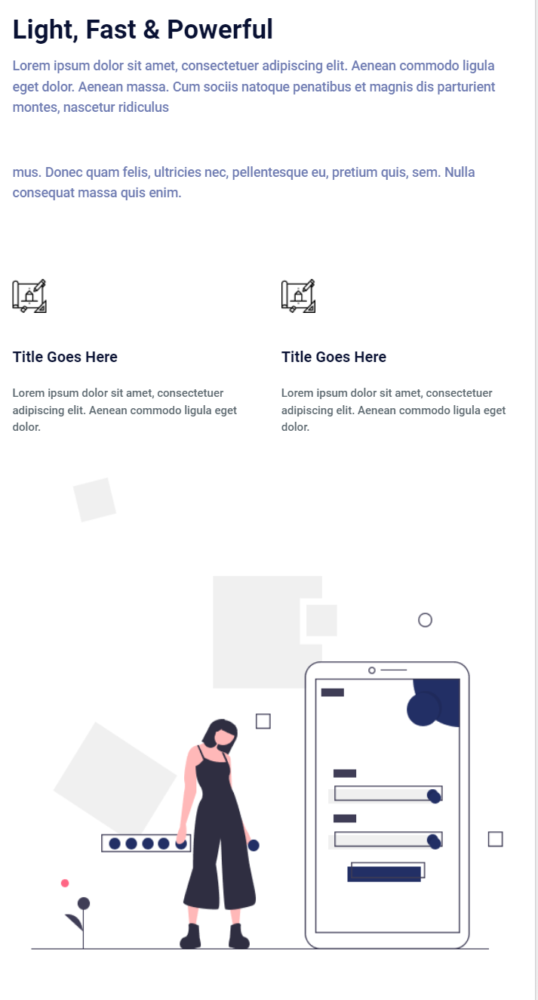
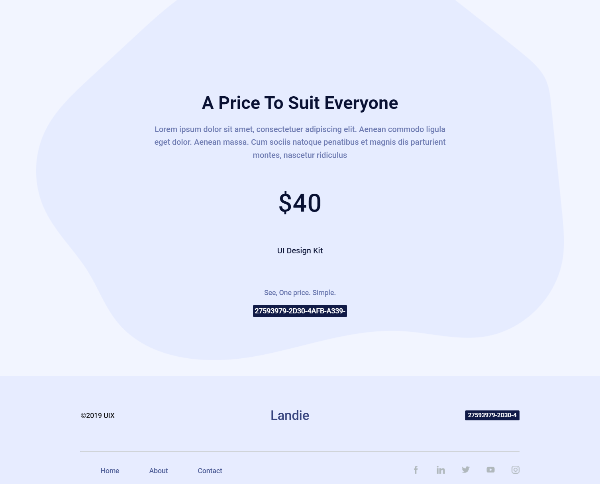
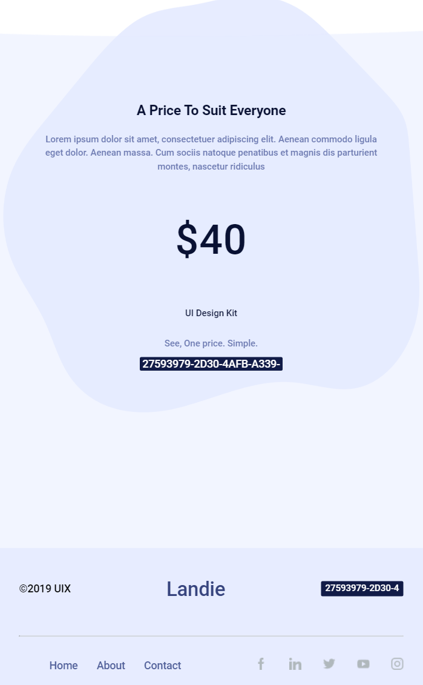

Практичне використання можливостей html, css та препроцесора Less.

## Мета проекту
Створення сайту з використанням препроцессора Less та медіа запросів.

## Як використовувати
Виберіть потрібно папку з компонентами в корні проекту і відкрийте index.html в браузері.

## Список компонентів які використовуються
* Препроцесор Less
* Медіа запроси

# Header

# Content

# Footer 

